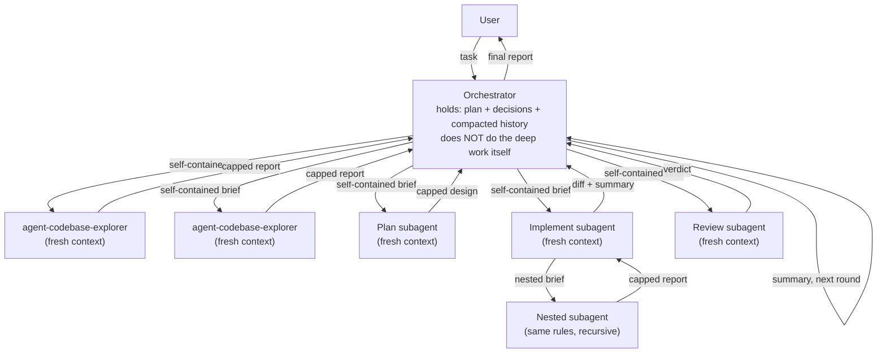

# Agents orchestration

By default, push focused work into fresh subagents. The orchestrator holds the plan, the decisions, and a compacted round-history — never raw findings, raw diffs, or raw tool output. Subagents work on one bounded unit, return a capped report, and are discarded. Findings flow up; the orchestrator collapses each report into 1-3 lines on the plan file and moves on.

This keeps the orchestrator's working context roughly constant in size regardless of how much work has been done.

## Topology



## Roles and responsibility borders

### Orchestrator

- Owns the goal, the plan, and the round counter.
- Decomposes work into units that each fit a single subagent's focus.
- Writes a self-contained brief per subagent (see context rules below).
- Receives reports; collapses each into 1-3 lines on the plan/memory file.
- Discards raw subagent output by referring to the summary going forward.
- Decides the next round.
- Reports to the user.
- **Does not do the deep work itself.** No exploration, no implementation, no review when a subagent can be spawned. Exception: truly trivial edits (see "When this doesn't apply").

### Subagent (Explore, Plan, Implement, Review)

- **Fresh context every spawn.** No memory of prior runs.
- Receives a brief that reads cold: a smart colleague who just walked into the room.
- Stays within the scope of the brief.
- Returns a capped, structured report. No raw tool output.
- May spawn its own deeper subagents for sub-problems, recursively, under the same rules.

### Nested (deeper) subagent

- Same rules as a subagent.
- Its brief is built by its immediate parent, not by the orchestrator. The orchestrator never reaches past one layer.

## Context rules

### Flow down (top → bottom)

Every brief includes:

- The goal (one sentence).
- What is already known (relevant findings, file paths, line numbers).
- What has been ruled out.
- Constraints (output shape, word cap, read-only vs. write).
- Expected return format.

A brief reads cold. It never relies on prior conversation. Pass file paths and line numbers verbatim, not as "the file you were looking at."

### Flow up (bottom → top)

Capped output, structured (findings → conclusions → recommendations). Typical caps:

| Subagent kind | Word cap |
|---|---|
| Explore / research | ≤ 500 |
| Plan / design | ≤ 1500 |
| Implement | structured diff + ≤ 500-word change summary |
| Review | ≤ 700 |

No raw tool output. No transcripts.

### Collapsing in the orchestrator

After each report:

1. Extract 1-3 key takeaways (the file path, the line number, the decision, the gap).
2. Append to the plan or memory file.
3. The next brief reads from the summary, not the raw report.

### Round boundaries

Between independent rounds the orchestrator:

1. Writes a "round N done" entry to the plan with the current state.
2. Treats its working context as if reset to (plan file + current task) for the next round. The harness's auto-compaction is a safety net; the file-based summary is the contract.

This pattern is more reliable than waiting for the harness to compact — the orchestrator controls when, and the summary survives across sessions because it is on disk.

## Sample patterns

### Planning a non-trivial change

1. Orchestrator spawns 2-3 `agent-codebase-explorer` subagents **in parallel** with disjoint scopes.
2. Each returns a capped report.
3. Orchestrator collapses each into 3-5 takeaways in the plan file.
4. Orchestrator spawns 1-2 Plan subagents briefed with the consolidated takeaways.
5. Plan subagents return designs.
6. Orchestrator picks one (or merges) and writes the final plan.

(This is the pattern the parallel-validation recipe specialises for post-migration audit — see [`parallel-validation.md`](parallel-validation.md).)

### Implementing the plan

1. Orchestrator decomposes the plan into N implementation units.
2. Spawns Implement subagents per unit (parallel where the units are independent).
3. Each returns a diff + summary.
4. Orchestrator verifies each, writes one line per unit to the plan.

### Code review

1. Orchestrator spawns a Review subagent given the diff + acceptance criteria.
2. Review subagent returns capped findings.
3. Orchestrator decides fix-and-respin vs. accept.

### Fixing a single issue (the most common case)

For a non-trivial fix: Investigate → Plan → Implement → Review as four sequential subagent spawns. Each step's output is collapsed into the plan before the next step's brief is written. The orchestrator never holds two raw reports at once.

## When this doesn't apply

- **Trivial single-line change.** Briefing a subagent costs more than doing the edit. Just do it.
- **Interactive clarification with the user mid-run.** Subagents cannot pause to ask the user. Keep that turn in the orchestrator.
- **Shared mutable state across parallel subagents.** They cannot communicate horizontally. If the work needs shared state, run serially or let the orchestrator be the merge point.

## "Always new" subagents — with one exception

Default is fresh subagents per spawn (no carried context). The exception is a single short follow-up to an investigator already in flight: continuing that agent (Claude Code: `SendMessage`) is cheaper than re-briefing a new one. Use sparingly; the default is still fresh.

## Keeping fan-out alive: full-toolset agents + healthy connectors

The whole fan-out discipline rests on subagents actually spawning. One mis-shaped tool can silently kill all of them at once, so connector health is not optional polish; it is what keeps the pattern working.

**Failure mode.** The Anthropic tool-use API rejects `oneOf` / `allOf` / `anyOf` at the TOP LEVEL of a tool's `input_schema` (the same combinator nested inside a property is fine). A subagent's init advertises its whole tool surface in ONE request, so a single tool that carries a top-level combinator fails the WHOLE request. Every subagent type then dies at once, and silently: the fan-out just stops happening, with no obvious error to trace back to the offending tool.

**Do not fix this by crippling the agents.** Giving fan-out agents a least-privilege `tools:` allowlist diverges from the rest of the ecosystem (agent-staff-engineer and the skills set no `tools:` and inherit everything) and strips them of the capabilities that make them useful. Fix it at the connector layer instead, and make the agents resilient.

**Fix the schema at the connector layer.** For an MCP server you control, strip top-level combinators from the ADVERTISED schema while keeping call-time validation intact, so the public surface is flat but every call is still checked. That is the pattern `mcp-github` uses (`src/registry.ts` plus `src/validation/advertise.ts`): advertise a flattened schema, enforce the full one at call time. For a connector you cannot edit, find the offender and disable it, but never probe one-by-one: run an automated schema-lint that connects to every reachable server, lists its tools, and flags any tool whose `input_schema` carries a top-level combinator (one pass clears all local servers and scales to hundreds); for servers you cannot introspect programmatically (managed or OAuth connectors), bisect by halves in O(log N).

**The agents inherit the full toolset and never halt on tool errors.** `agent-codebase-explorer`, `agent-plan-reviewer`, and `agent-implementation-auditor` set no `tools:` field, so they inherit every capability the environment exposes; their prompts are tool-agnostic and resilient, using whatever is present and degrading around anything missing or unhealthy rather than aborting. Install them once via `@ctxr/kit` so they are available everywhere:

```bash
npx @ctxr/kit install --user @ctxr/agent-codebase-explorer @ctxr/agent-plan-reviewer @ctxr/agent-implementation-auditor
```

Project-local copies in `.claude/agents/` are picked up when a session starts; the kit-installed user-level copies are available in every session and project.

## Optional review gates

> **Skip this section if `subagent_review` is off in the active project.**

Two OPT-IN checkpoints where the orchestrator OFFERS a parallel-subagent review by ASKING the user, and proceeds only if they accept. The user may decline at each gate, and the work continues as normal. The gates are reviews, not background work: run them in the foreground when accepted, then continue.

**Gate 1: plan-review at confirmation.** Before confirming a non-trivial plan (on Claude Code, before `ExitPlanMode`), ask the user whether to run a parallel plan-review. If they accept, fan out 2-3 `agent-plan-reviewer` agents over the PLAN with disjoint lenses (gaps, divergences from the user's intent, blind spots, edge cases, infeasibilities, missed files or steps). Fold the findings into the plan, revise it, then confirm.

**Gate 2: conformance-review after implementation.** Before declaring the work done (at merge-prep), ask the user whether to run a parallel conformance-review. If they accept, fan out `agent-implementation-auditor` agents to check the BUILT work against the plan (missed items, divergences from locked decisions, cross-implementation parity). Fold the findings, then fix-or-accept each.

Both gates use the scoped read-only agents from the tool-scoping section above, so they stay immune to the connector failure mode. The post-migration issue-tree audit in [`parallel-validation.md`](parallel-validation.md) is a specialization of the same fan-out-and-audit idea (a fixed three-agent recipe scoped to touched issues); these gates are the general plan-vs-work form of it.

This section is about reviews only. It does NOT change the foreground-only, no-background polling discipline: the gates add an optional review step, not any new polling or wake-up behaviour.

## Why this matters

Without this pattern, the orchestrator's context grows linearly with every tool call, every exploration result, every diff. By round 3 it has lost the plot — recommendations start to drift, decisions get re-asked, and the harness eventually compacts under pressure (which is lossier than a hand-written summary).

With this pattern, the orchestrator stays at roughly constant size: plan file + current task brief + compacted round history. Throughput scales with subagent fanout, not with orchestrator context bloat.
